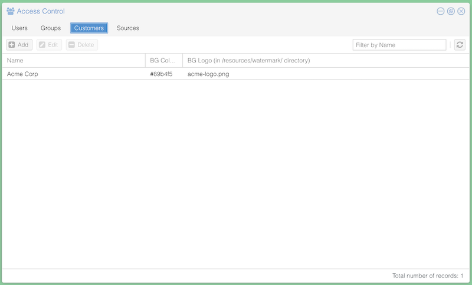
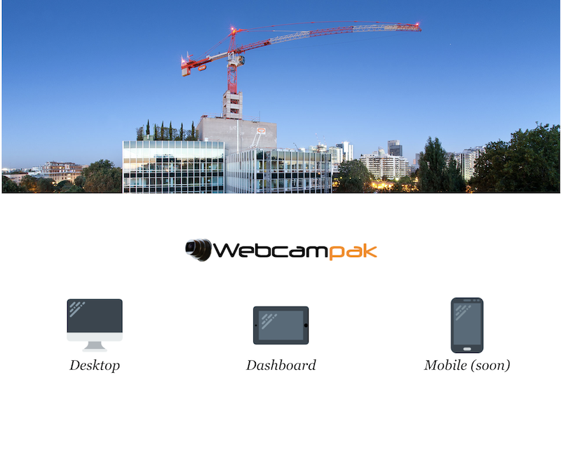

# Branding

You might want Webcampak UI to reflect your own branding, this can be done at multiple levels detailed in this page.
 
## Custom background

You can easily modify the background and logo displayed after logging into webcampak by creating a "Customer", configuring a background color and a background logo (which will be automatically centered on the page).

[](images/branding_customer.png "Click to see the full image.")

The PNG logo can be placed into the `resources/watermark/` folder, you can do so over FTP using the `wpresources` account (see: https://doc.webcampak.com/webcampak3.x/web/en/Configure/en_System/)

Once a customer is created, simply assign users to this customer.

## Custom landing page

The landing page, built in HTML can be fully customized.

[](images/branding_landing.png "Click to see the full image.")

This page does not require any compilation, and is a set of static assets being served to the user, modifying this content will be reflected directly to the user.

Assuming webcampak is installed in the `~/webcampak/` folder, the following content can be customized:

| Location | Description |
| --- | --- |
| `~/webcampak/apps/ui/assets/non-https/` | Files in this folder are served when the user connects the non HTTPS version of the site |
| `~/webcampak/apps/api/Symfony/3.0/web/` | Files in this folder are served when the user connects to the HTTPS version of the site |

Your starting point in both folders is to modify the `index.html` file.

### Application links

When creating your new HTML landing page, a set of links can be used to point the user to the various applications in various languages, you can use the following:

* `/app.php/desktop`: To redirect to the Desktop app in English
* `/app.php/desktop-fr_FR.utf8`: To redirect to the Desktop app in French
* `/app.php/desktop-it_IT.utf8`: To redirect to the Desktop app in Italian
* `/dashboard.php/dashboard`: To redirect to the Dashboard in English

### Disable the landing page

You might actually not want to display a landing page altogether and have your users redirected directly to the Desktop app.

For example, an immediate redirect can be created by replacing the file: `~/webcampak/apps/api/Symfony/3.0/web/index.html` with:

```html
<!DOCTYPE html>
<html>
    <head>
        <meta http-equiv="refresh" content="0; URL=/app.php/desktop-it_IT.utf8" />
    </head>
</html>
```

Users will never see a landing page and will be redirected directly to the Desktop app in Italian. You can modify this link using the "Application links" detailed above.

## Custom links

A set of additional links are available in Webcampak Desktop UI (such as the top left menu, the bottom left toolbar).

These links can be customized by editing the file `~/webcampak/config/config-links.json`.

```json
[
    {
        "LOCATION": "BOTTOM_LEFT",
        "NAME": "www.webcampak.com",
        "LINK": "http://www.webcampak.com"
    },
    {
        "LOCATION": "TOP_LEFT_MENU",
        "NAME": "Documentation",
        "LINK": "http://www.webcampak.com/doc/",
        "GLYPH": "xf02d"
    },
    {
        "LOCATION": "TOP_LEFT_MENU",
        "NAME": "Blog",
        "LINK": "http://blog.webcampak.com",
        "GLYPH": "xf0ac"
    },
    {
        "LOCATION": "TOP_LEFT_MENU",
        "NAME": "About",
        "LINK": "http://www.webcampak.com",
        "GLYPH": "xf0ac"
    }
]
```

Although you can only specify one `BOTTOM_LEFT` entry, you can provide as many `TOP_LEFT_MENU` entries as you wish, these will be added to the menu.

The `GLYPH` is the small icon displayed next to the menu entry, you can use any glyphs available on fontAwesome (https://fontawesome.com/icons) in version 4.4.0 (https://fontawesome.com/v4/icons/).

The value to enter corresponds to the Unicode of the icon prefixed with `x`.

Please make sure this file follows the JSON standard, if unsure, you can validate it with a JSON linter such as: https://jsonlint.com/
